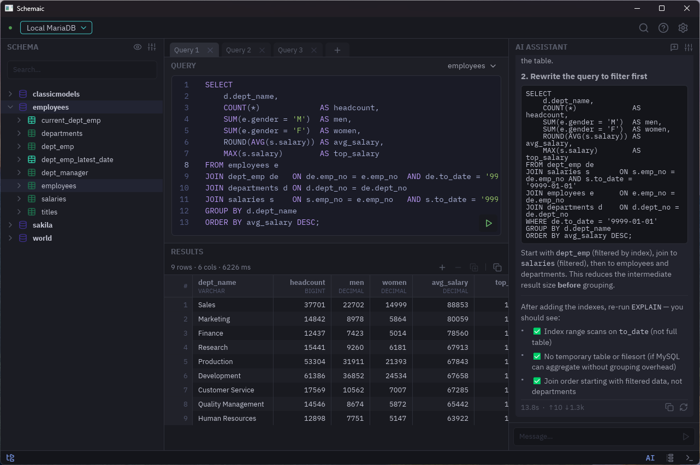

# Schemaic

A fast, native SQL editor for MySQL and MariaDB — written in Rust, Zed-inspired,
built to feel instant.

<p align="center">
  
</p>

## Notice

Schemaic is in active development. It should **not** be used or trusted with
production data, or any data you care about.

Saved connection passwords are currently stored in **plaintext** on disk.
Encrypting them (via the OS keyring) is a planned fix in the near future.

## Why

- **Fast** — GPU-rendered UI ([Floem](https://github.com/lapce/floem)); scrolls
  200k-row result sets smoothly and searches them without lag.
- **Lightweight** — a single native binary. No Electron, no bundled browser.
- **Native** — real desktop app on Windows and Linux.

## Features

- SQL editor with syntax highlighting, schema-aware autocomplete, and one-key
  formatting.
- Results grid with inline editing that writes back to the database
  (transactional, with a per-row safety net), plus sort, freeze, and export
  (CSV / JSON / SQL).
- Schema browser, query history, and a global "find anywhere" for schema objects.
- Secure connections over SSH tunnels.
- Built-in AI assistant (pass-through to the `claude` CLI).

## Build & run

Requires a recent Rust toolchain (edition 2024).

```sh
cargo run -p schemaic-app
```

On Linux you'll also need the GUI system libraries the renderer depends on, e.g.
on Debian/Ubuntu:

```sh
sudo apt-get install -y libxkbcommon-dev libwayland-dev libxcb1-dev libx11-dev pkg-config
```

## License

MIT — see [LICENSE](LICENSE). Third-party notices are in
[THIRD-PARTY-NOTICES.md](THIRD-PARTY-NOTICES.md).
