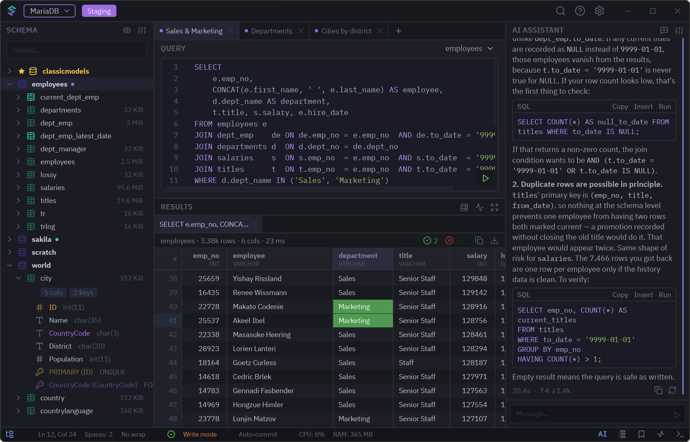

# Schemaic

A fast, native SQL editor for MySQL, MariaDB, and PostgreSQL — written in Rust,
with an editable results grid and schema-aware intelligence, built to feel instant.

<p align="center">
  
</p>

## Notice

Schemaic is in active development. It should **not** be used or trusted with
production data, or any data you care about.

Saved connection secrets (database and SSH passwords, SSH key passphrases) are
stored in the **OS keyring** (Windows Credential Manager / Secret Service /
macOS Keychain), not in the config file. On a machine with no keyring available
they fall back to plaintext on disk so the app still works.

## Why

- **Fast** — GPU-rendered UI ([Floem](https://github.com/lapce/floem)); scrolls
  200k-row result sets smoothly and searches them without lag.
- **Lightweight** — a single native binary. No Electron, no bundled browser.
- **Native** — real desktop app on Windows and Linux.

## Features

- **SQL editor** — syntax highlighting, schema-aware autocomplete, structure-aware
  diagnostics (unknown tables/columns, syntax errors, typo hints) from a real
  per-dialect parser, one-key formatting, auto-closing pairs, and bracket matching.
- **Results grid** — inline editing that writes back to the database
  (transactional, with a per-row safety net); add / duplicate / delete rows;
  server-side filter and sort straight from the column headers; per-column freeze;
  a whole-row JSON view/edit panel; per-column display formatters; and export to
  CSV / JSON / SQL / Markdown / HTML.
- **Navigate** — schema browser with favorites, query history, `EXPLAIN` query
  plans, and a global "find anywhere" for schema objects.
- **Connect** — MySQL / MariaDB / PostgreSQL, direct or over SSH tunnels, with
  per-connection colors, environment badges, and a read-only guard-rail.
- **AI assistant** — pass-through to the `claude` CLI, with a built-in MCP server
  so it can read your schema and query the database.
- **Themeable** — dark / light UI themes and multiple editor color schemes.

## Build & run

Requires a recent Rust toolchain (edition 2024).

```sh
cargo run -p schemaic-app
```

On Linux you'll also need the GUI system libraries the renderer depends on, e.g.
on Debian/Ubuntu:

```sh
sudo apt-get install -y libxkbcommon-dev libwayland-dev libxcb1-dev libx11-dev pkg-config
```

## License

MIT — see [LICENSE](LICENSE). Third-party notices are in
[THIRD-PARTY-NOTICES.md](THIRD-PARTY-NOTICES.md).
