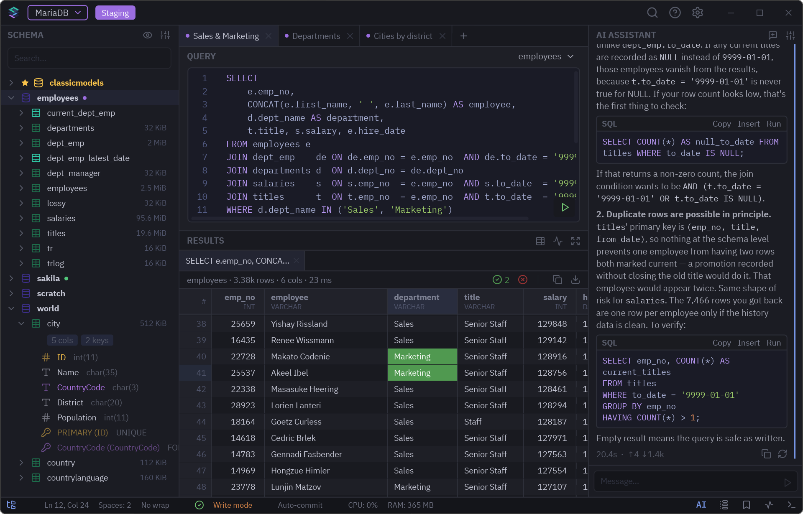

# Schemaic

A fast, native SQL editor for MySQL, MariaDB, PostgreSQL, SQL Server and SQLite,
written in Rust, with an editable results grid, visual schema editing, and
schema-aware intelligence, built to feel instant.

<p align="center">
  
</p>

## Why

- **Fast.** A GPU-rendered UI ([Floem](https://github.com/lapce/floem)) that
  scrolls and searches 200k-row result sets without lag.
- **Lightweight.** A single native binary. No runtime to install, no embedded
  browser.
- **Native.** A real desktop app on Windows, Linux and macOS.
- **Guard-rails.** Writes go through a missing-`WHERE` check, grid edits roll
  back unless exactly one row changed, and generated `ALTER` and `DROP` is shown
  as SQL, with what it destroys named in plain language, before it runs.
- **Local.** No account, no telemetry, no API key. Credentials live in the OS
  keyring. The AI assistant runs through your own agent CLI, under that CLI's
  account and terms, and the panel tells you which restrictions are actually in
  force for it before you send anything.
- **Every engine, properly.** Quoting, DDL, completion and diagnostics follow the
  dialect you're connected to. What an engine can't do isn't offered, and what it
  does differently is handled for you, like SQLite's twelve-step table rebuild.

## Features

- **SQL editor.** Highlighting, schema-aware completion, diagnostics from a real
  per-dialect parser, formatting, snippets, and `:name` parameters you fill in
  before the run. Open, save and run `.sql` files.
- **Results grid.** Edit cells and write them back, add, duplicate and delete
  rows, filter and sort on the server, freeze columns, and paste a block from a
  spreadsheet. Binary cells preview as images or hex. Export to CSV, JSON, SQL,
  Markdown, HTML or Excel.
- **Transactions.** A per-tab manual mode with explicit commit and rollback, and
  an optional statement timeout.
- **Schema editing.** A visual table designer, editors for views, triggers,
  routines, sequences and types, and create and drop for databases and schemas.
  Every change is previewed as SQL first.
- **Compare schemas.** Diff two databases on the same engine and apply the
  differences you tick as one migration.
- **Import and export.** Load CSV, TSV, JSON or Excel into a table, with every
  problem reported before a row is written. Dump a database, schema or table to
  one `.sql` file or a file per table.
- **Users and activity.** Accounts, roles and grants; live sessions with lock
  waits, *Kill session* and *Cancel query*; and a Live Monitor that streams a
  table's inserts, updates and deletes.
- **Navigate.** A schema browser with favourites and table sizes, query history,
  `EXPLAIN` plans, find-anywhere, and an ER diagram.
- **Connect.** Direct, over SSH, or with TLS. SQL Server signs in with a SQL
  login, Windows or Microsoft Entra. Bring your connections over from a URL,
  DBeaver, DataGrip, `~/.my.cnf` or `~/.pgpass`. Per-connection colours,
  environment badges and a read-only mode.
- **Terminal.** An embedded shell, and a one-click `mysql`, `psql`, `sqlite3` or
  `sqlcmd` session on the active connection.
- **AI assistant.** Drives your own Claude Code, Codex, Antigravity, OpenCode,
  GitHub Copilot or Cursor. Fix a failed query, rewrite the statement under the
  caret (Ctrl+K), explain or optimise it, or generate realistic rows. It reads
  your schema through a built-in [MCP server](#mcp-server), proposes table
  changes through the same preview as a hand edit, and sees only as much data
  as you allow per connection.
- **Themes.** Dark and light themes, editor colour schemes, and an interface
  scale up to 160%.

### Accessibility

Schemaic is **keyboard-operable but not screen-reader accessible**. Every modal
has a focus ring and a Tab order, destructive actions in modals, the schema tree
and the results grid can be reached and confirmed from the keyboard, the
header's **?** lists every shortcut, and **Settings → Appearance → Interface
scale** enlarges the whole interface up to 160%. The exception is the Server
Activity panel, where a row's *Kill session* and *Cancel query* need a
right-click (the lock-wait banner's **Kill** button is keyboard-reachable).

Floem 0.2 exposes no accessibility tree, so Narrator, VoiceOver and Orca have
nothing to read. If you rely on a screen reader, Schemaic can't serve you yet.

## Command line

The `schemaic` command runs statements against your saved connections without
opening the window. It never takes a credential: the connection comes from your
saved list and its password from the OS keyring, so a script or an AI agent can
be handed a connection name instead of a password.

```sh
schemaic list
schemaic tables -c prod -d shop
schemaic query "SELECT * FROM orders LIMIT 5" -c prod -d shop --format=json
schemaic exec "UPDATE orders SET state = 'sent' WHERE id = 7" -c prod
```

- `query` only reads, on a session the server holds read-only, and returns 200
  rows unless you raise `--limit`.
- `exec` writes. It refuses on a read-only connection, and a statement the guard
  flags, such as a `DELETE` with no `WHERE`, needs `--yes`.
- Output is a table, JSON, JSON Lines, CSV or vertical records. Rows go to
  stdout and everything else to stderr.

A connection is reachable only once you turn on **CLI access** in its settings;
it is off by default. Where there is no keyring, such as over SSH or in a
container, `--password-stdin` takes the password instead. `schemaic --help`
covers the other commands, the formats and the exit codes.

To put `schemaic` on your `PATH`, use **Settings → General → Command line →
Install**. The Linux `.deb` and `.rpm` do this for you.

## MCP server

`schemaic mcp` serves one saved connection to any AI agent that speaks
[MCP](https://modelcontextprotocol.io), such as an editor's assistant or a
desktop app. It is the same server Schemaic's own AI panel uses, and it is meant
for the agent to launch:

```json
{ "mcpServers": { "prod": { "command": "schemaic", "args": ["mcp", "--connection=prod"] } } }
```

The agent gets `list_schema` and `describe_table`, plus `run_query` (read-only,
200 rows) when the connection's **AI data access** is *Let it read data*. Like
the command line, it needs **CLI access** turned on for the connection.

## Install

Binaries for every release are on the
[Releases page](https://github.com/fadion/schemaic/releases/latest), for
**Windows and Linux (x86_64)** and **macOS (Apple Silicon)**. The self-updating
builds check GitHub for a new release in the background; set
`SCHEMAIC_NO_UPDATE_CHECK=1` to turn that off.

### Windows

Download and run **`Schemaic-win-x64-Setup.exe`**. It installs per-user, with no
admin prompt, and updates itself. The installer isn't code-signed, so SmartScreen
warns the first time: click *More info*, then *Run anyway*.

`schemaic-vX.Y.Z-windows-x86_64.zip` is a portable build that doesn't update
itself.

### macOS

```sh
curl -fsSL https://raw.githubusercontent.com/fadion/schemaic/main/install.sh | bash
```

This installs Schemaic into `/Applications`, and it updates itself from then on.

To install by hand, take **`Schemaic-osx-arm64.dmg`** (or the `.pkg`) and drag
Schemaic into `/Applications`. The app isn't signed with an Apple Developer ID,
so macOS blocks the first launch: open it once, then click **Open Anyway** in
**System Settings → Privacy & Security**, or run
`xattr -dr com.apple.quarantine /Applications/Schemaic.app`.

### Linux

```sh
curl -fsSL https://raw.githubusercontent.com/fadion/schemaic/main/install.sh | bash
```

On Debian and Ubuntu this adds the signed apt repository, on Fedora, RHEL and
openSUSE the dnf/zypper repository, and elsewhere it installs the self-updating
AppImage. Packaged installs update with the rest of your system. Read
[install.sh](install.sh) first if you prefer; it asks for `sudo` and prints the
uninstall steps at the end. `SCHEMAIC_PKG_FAMILY=debian|rpm|appimage` overrides
its choice, and `SCHEMAIC_NO_REPO=1` installs a single package without adding a
repository.

#### Adding the repository by hand

Debian, Ubuntu and derivatives:

```sh
curl -fsSL https://fadion.github.io/schemaic/schemaic-archive-keyring.gpg \
  | sudo tee /usr/share/keyrings/schemaic-archive-keyring.gpg > /dev/null
curl -fsSL https://fadion.github.io/schemaic/schemaic.sources \
  | sudo tee /etc/apt/sources.list.d/schemaic.sources > /dev/null
sudo apt-get update && sudo apt-get install schemaic
```

Fedora, RHEL and CentOS (on openSUSE, `zypper` in place of `dnf`):

```sh
sudo curl -fsSL https://fadion.github.io/schemaic/schemaic.repo \
  -o /etc/yum.repos.d/schemaic.repo
sudo dnf install schemaic
```

The first `dnf install` asks twice to import the signing key. Check that it
matches this fingerprint before you accept:

```
ABDBDC3958F3FAFC734273796566ECED7795DC1A
```

#### Release files

| File | Install | Updates itself |
| --- | --- | --- |
| `Schemaic-linux-x64.AppImage` | `chmod +x` and run | Yes |
| `schemaic_X.Y.Z_amd64.deb` | `sudo apt-get install ./schemaic_*.deb` | No |
| `schemaic-X.Y.Z-1.x86_64.rpm` | `sudo dnf install --nogpgcheck ./schemaic-*.rpm` | No |
| `schemaic-vX.Y.Z-linux-x86_64.tar.gz` | Extract anywhere | No |

The `.deb` and `.rpm` on the Releases page are unsigned; the repository copies
are signed. The app needs `libxkbcommon`, Wayland or X11, and Vulkan or EGL at
runtime, which the packages declare.

## Build & run

Requires a recent Rust toolchain (edition 2024) and a C compiler, since SQLite is
compiled in from source: the MSVC tools on Windows, `xcode-select --install` on
macOS, `gcc` on Linux. No database client libraries are needed.

```sh
cargo run -p schemaic-app
```

On Linux the renderer also needs a few GUI libraries.

Debian / Ubuntu:

```sh
sudo apt-get install -y libxkbcommon-dev libwayland-dev libxcb1-dev libx11-dev pkg-config
```

Fedora / RHEL:

```sh
sudo dnf install libxkbcommon-devel wayland-devel libxcb-devel libX11-devel pkgconf-pkg-config
```

Arch:

```sh
sudo pacman -S --needed libxkbcommon wayland libxcb libx11 pkgconf
```

## Licence

MIT, see [LICENSE](LICENSE). Third-party notices are in
[THIRD-PARTY-NOTICES.md](THIRD-PARTY-NOTICES.md).
